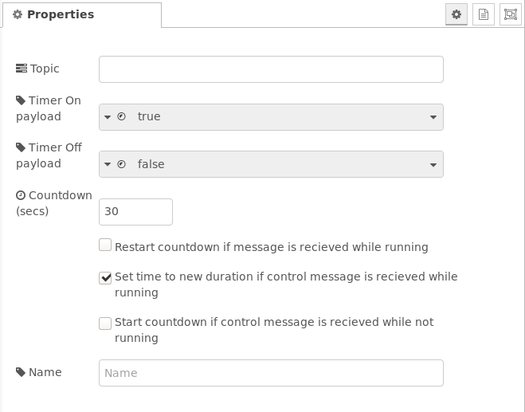

# node-red-contrib-countdown
`node-red-contrib-countdown` is a simple countdown node.  
It starts a **countdown timer** on a received input `msg` and decreases the counter value (at the first output) until the countdown timer elapses. The countdown can be **stopped at any time**. Also the countdown timer can be set to any new countdown value at any time to **reload the timer** with a specific value.

The output can **emit a `msg`** at its first output with an arbitrary `msg.payload` contents at the **start** of the timer as well as at the **stop** of the countdown timer.   
At the **second Output** the node emits the remaining counter value every second.

The node's output `msg` can optionally contain an arbitrary topic string.

Loosely based on prior work by Neil Cherry: https://github.com/linuxha/node-red-contrib-mytimeout

  
**Fig. 1:** Node appearance

## Installation

### In Node-RED (preferred)
* Via Manage Palette -> Search for "node-red-contrib-countdown"

### In a shell
* go to the Node-RED installation folder, e.g.: `~/.node-red`
* run `npm install node-red-contrib-countdown`

## Usage

### Node Configuration

  
**Fig. 2:** Node properties

#### Countdown (secs) property
Set the ***Countdown*** value to the desired countdown time in seconds. The timer will start with this countdown value to decrease the timer value (countdown start value).

#### Topic
The ***Topic*** can be set to any string value. This string is added to the output `msg` as an additional element `msg.topic`.  

**Note:** No value is given to the topic.

#### Timer On payload, Timer Off payload
Set the ***Timer On payload*** to any payload type and value which is sent when the counter starts.  
Set the ***Timer Off payload*** to any payload type and value which is sent when the counter elapses.  
In both cases, also nothing to be emitted may be chosen.

#### Flags
You can configure the timer to
- **restart** (reload) the timer to its countdown start value during the count down whenever a `msg` is received at the node's input.
- activate the ability to **set the timer value** to an arbitrary value during the count down with the use of a control `msg`.
- **start the timer** with a control `msg` (i.e. a `msg` with a *control* topic string).

## Input
The node evaluates the following input `msg` types:
- Input `msg` with a `msg.payload` contents of false (boolean) or '0' (number).  
  This `msg` type stops resp. finishes the timer. The *Timer Off payload* is emitted also in this case.
- Input `msg` with a `msg.topic` set to "control" and a `msg.payload` set to an arbitrary number value. This reloads the timer with the desired `msg.payload` value immediately and works at a running countdown as well as a non startet or elapsed countdown timer.  
- All other input `msg` do start/restart the timer if it is stopped.

## Outputs
The node contains two outputs:
- The **primary output** (upper output) emits an output `msg` at the **countdown start/stop** instant of time.  These `msg.payload` contents are configurable
- The **secondary output** (lower output) emits the **remaining time every second** during the timer runs. The `msg.payload` holds the remaining counting value

## Examples

### Basic behaviour
This example shows the basic behaviour with
- starting the timer via an input `msg` (inject node)
- showing the behaviour of the two outputs of the node

Just activate the inject and look at the output debug node status messages.

  
[**basic flow**](examples/FlowBasic.json)  
**Fig. 3:** Basic example flow

### Sending messages and retriggering
This example shows how to
- handle messages at the start and the end of the countdown
- retrigger the timer during it runs

Text messages are output on the first output at start and end of the countdown.  
You can restart the timer by activating the inject node during the countdown runs.

  
[**messages and retriggering flow**](examples/FlowRetriggerAndMessages.json)  
**Fig. 4:** Message sending and retriggering example flow

### Stopping the countdown timer
This example shows the two options to stop the countdown timer.

  
[**stopping timer flow**](examples/FlowStop.json)  
**Fig. 5:** Timer stopping example flow

### Reloading the countdown timer
This example shows the functionality of reloading the countdown value during a running timer.

  
[**reloading timer flow**](examples/FlowReload.json)  
**Fig. 6:** Timer reload example flow
